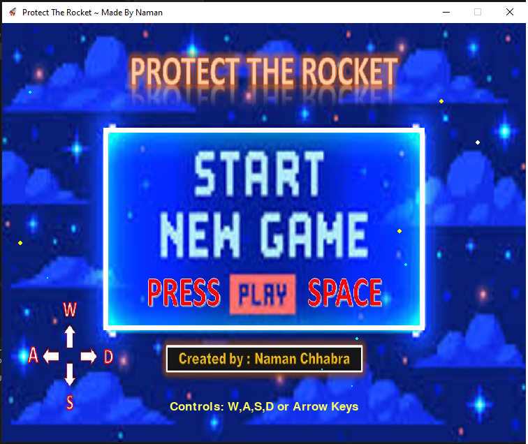
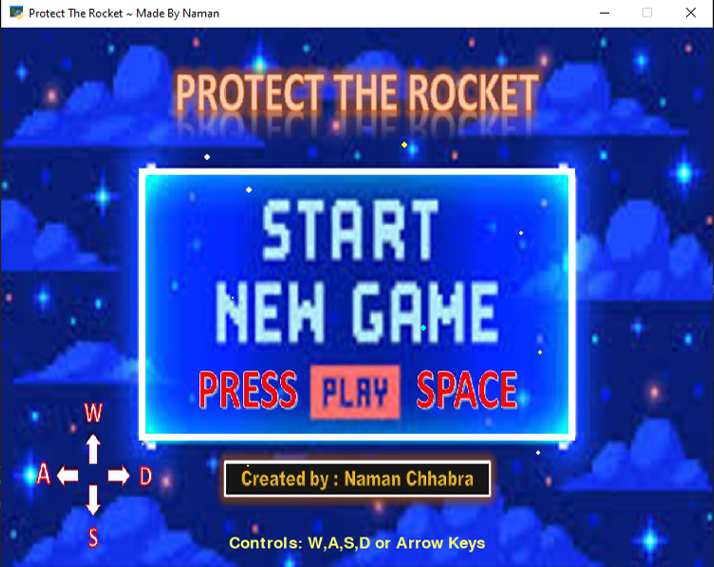
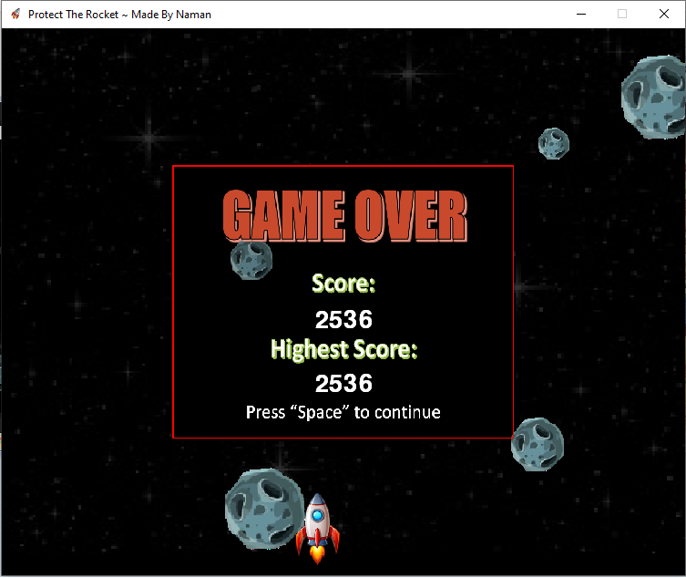
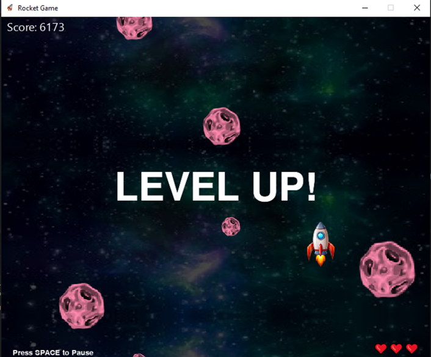
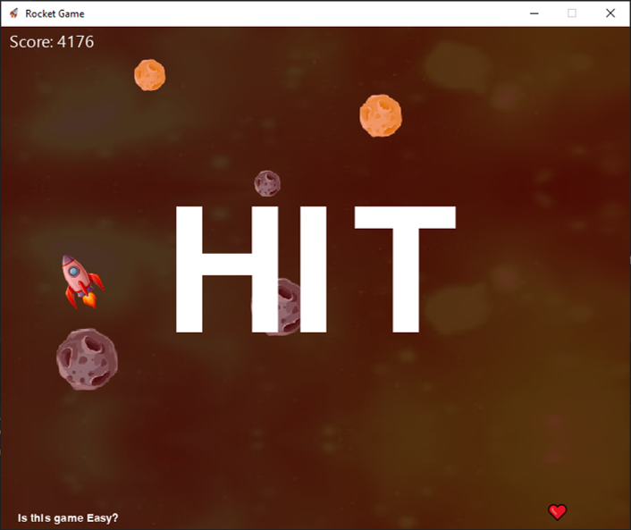
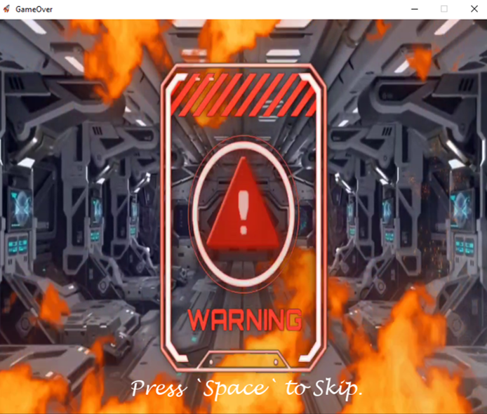
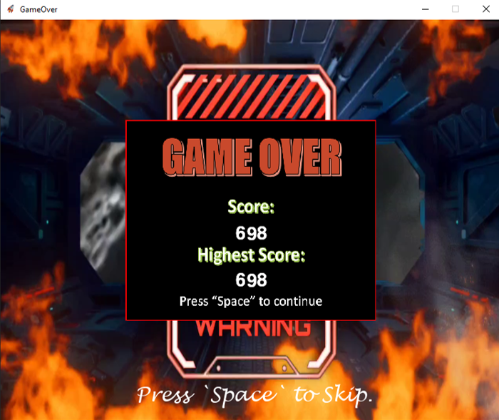

# Rocket-Game
An UNENDING 2D rocket Game created with Pygame. Featuring custom music, graphics, and keyboard controls. Contains Starting and Ending scene as Videos.

Controls:
  - `WASD` / Arrow Keys to move
  - `Space` to Start / Pause the Game | Skipping Scenes
  - `m` to mute / unmute sounds
    
Modules Used:
  - pygame
  - splashscreen_engine ( Install it using `pip install splashscreen-engine==2.0.4` )
  - time
  - os
  - random
  - threading
  - sys
  - platform
  - requests
  - json
  - datetime
  - uuid
  - customtkinter
---
## Enabled with ingame Data Processing
- Using Google's Firebase to store User data.
- Using it for realtime data tracking ,feedback and rating support.
## Screenshots:
### Loading Screen

### Starting Screen

### Scene-1 The Rocket Starts

### Level Up ( After every 3000 score )

### Collision of Rocket with Obstacles

### Scene-2 The Game Ends

### GAMEOVER

